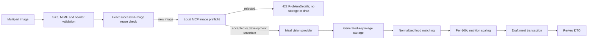

# Meal analysis pipeline

The current draft-analysis pipeline adds a local MCP image preflight gate before any meal-vision provider receives a new image:

`IImagePreflightDetector` isolates the application policy from MCP. The Infrastructure adapter calls the local Streamable HTTP MCP server's allowlisted `preflight_image` tool. The MCP server uses the configured local model service for food relevance and basic image quality. MCP is only the transport/tool boundary; it is not the classifier.

`IMealImageStorage` isolates storage from the application pipeline. New images are stored only after preflight and meal analysis has begun. The local implementation generates every path server-side and never uses a client filename as a storage key. If analysis or persistence fails after storage, the newly stored file is removed. Production should use private object storage and expiring access URLs.

Explicit preflight rejection returns HTTP 422 with safe issue codes such as `NonFoodImage`, `Blurry`, or `TooDark`. If the local preflight service is unavailable, production fails closed with HTTP 503. Development/testing may continue with a warning when configured to allow uncertainty. No raw image bytes, base64 payloads, MCP responses, or model credentials are logged or persisted.

Food matching uses exact normalized canonical or alias matches visible to the requesting user. AI output never becomes authoritative nutrition data: nutrients are calculated only from a matched Phase 4 food record and estimated grams. Unmatched foods remain in the draft with zero calculated nutrients and require confirmation.

`POST /api/meals/analyse` accepts multipart form fields `image`, `locale`, `cuisineHints`, `consumedAtUtc`, and Development-only `mockScenario`. `GET /api/meals/{mealId}/review` returns only drafts owned by the current development identity.

Stored metadata excludes raw provider responses and image bytes. Analysis records retain hashes, provider/model/version identifiers, timing, and safe status fields. Meal images may contain sensitive information; retention and deletion policies must be finalized before production.
