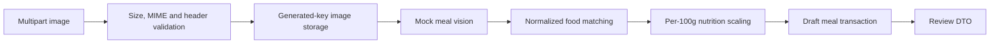

# Meal analysis pipeline

Phase 6 implements draft analysis only:

`IMealImageStorage` isolates storage from the application pipeline. The local implementation generates every path server-side and never uses a client filename as a storage key. If analysis or persistence fails, the newly stored file is removed. Production should replace local storage with private object storage and expiring access URLs.

Food matching uses exact normalized canonical or alias matches visible to the requesting user. AI output never becomes authoritative nutrition data: nutrients are calculated only from a matched Phase 4 food record and estimated grams. Unmatched foods remain in the draft with zero calculated nutrients and require confirmation.

`POST /api/meals/analyse` accepts multipart form fields `image`, `locale`, `cuisineHints`, `consumedAtUtc`, and Development-only `mockScenario`. `GET /api/meals/{mealId}/review` returns only drafts owned by the current development identity. No confirmation, dashboard mutation, or final logging is implemented.

Stored metadata excludes raw provider responses and image bytes. Analysis records retain hashes, provider/model/version identifiers, timing, and safe status fields. Meal images may contain sensitive information; retention and deletion policies must be finalized before production.
