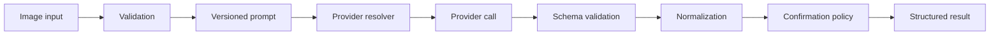

# Meal vision architecture

`IMealVisionProvider` isolates provider communication. `IMealVisionAnalysisService` validates images, creates the prompt, invokes the selected provider, validates all structured fields, normalizes safe values, and derives `RequiresConfirmation`. Provider output contains identity and portion candidates only; Phase 4 food data remains authoritative for nutrition.

Mock scenarios include `BengaliLunch`, `NoFood`, `PoorImageQuality`, `AmbiguousFishCurry`, `DuplicateItems`, `MalformedResponse`, `ProviderTimeout`, and `ProviderFailure`. Mock makes no network request. OpenAI and Gemini are configuration values reserved for future implementations and fail clearly if selected.

Images and raw responses are not persisted. Raw images, base64, secrets, and full provider responses are excluded from logs. External provider consent, retention terms, and data-processing policies must be reviewed before enabling a production provider. Single-photo portion estimates remain uncertain and require confirmation according to deterministic thresholds.
