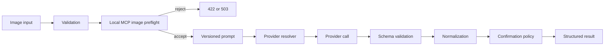

# Meal vision architecture

`IMealVisionProvider` isolates provider communication. `IMealVisionAnalysisService` validates images, runs preflight, creates the prompt, invokes the selected provider, validates all structured fields, normalizes safe values, and derives `RequiresConfirmation`. Provider output contains identity and portion candidates only; Phase 4 food data remains authoritative for nutrition.

## Local MCP preflight

The API owns the policy decision and exposes only the application contract `IImagePreflightDetector`. Infrastructure connects to one local Streamable HTTP MCP server and calls only `preflight_image`. The server forwards the image to the configured local model service and returns food relevance, confidence, quality score, quality acceptance, safe issue codes, detector version, and duration.

The preflight gate runs after technical image validation and before OpenAI, Gemini, Anthropic, Ollama meal analysis, or an OpenAI-compatible provider. Explicit non-food or unacceptable-quality images are rejected with HTTP 422 and are not retained. A missing or unavailable detector is HTTP 503 in production; Development and Testing can allow an uncertain result with a warning.

The MCP service is bound to loopback or the internal container network, restricts allowed hosts, does not enable browser CORS, and does not log image request bodies. MCP is a protocol boundary, not an authorization boundary: the API remains responsible for thresholds, fail-closed behavior, and provider selection.

Mock scenarios include `BengaliLunch`, `NoFood`, `PoorImageQuality`, `AmbiguousFishCurry`, `DuplicateItems`, `MalformedResponse`, `ProviderTimeout`, and `ProviderFailure`. Mock makes no network request. OpenAI and Gemini are configuration values reserved for future implementations and fail clearly if selected.

Images and raw responses are not persisted by the preflight service. Raw images, base64, secrets, MCP payloads, and full provider responses are excluded from logs. External provider consent, retention terms, and data-processing policies must be reviewed before enabling a production provider. Single-photo portion estimates remain uncertain and require confirmation according to deterministic thresholds.
